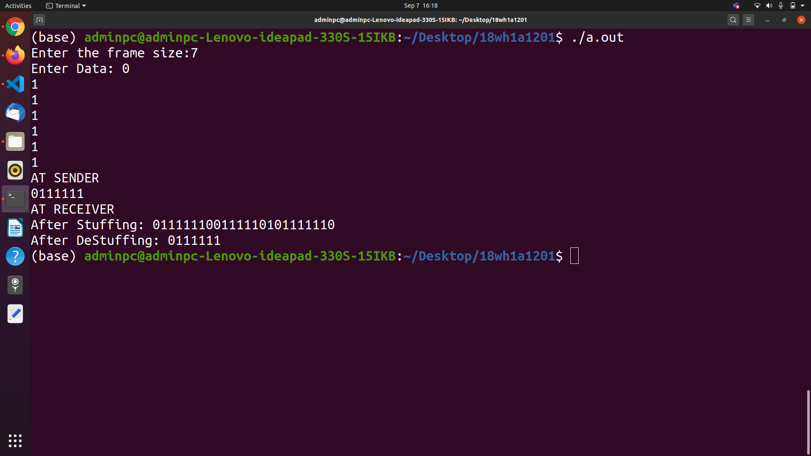
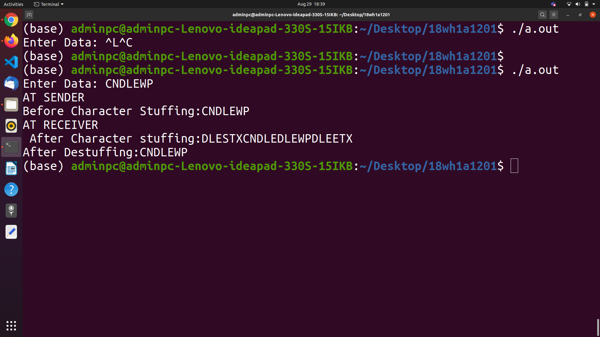

# Experimet 1

## Aim of the Experiment
To implement data link layer framing techniques such as
i. character count  ii. bit stuffing and iii. Character stuffing

### Steps or Procedure of experiment

#### Character count
This method uses a field in the header to specify the number of characters in the frame.
When the data link layer at the destination sees the character count,it knows how many characters follow, and hence where the end of the frame is. 

#### Bit Stuffing
Bit stuffing is the insertion of non information bits into data. Note that stuffed bits should not be confused with overhead bits.
For instance, use the two-character sequence 01111110  to signal the beginning of a frame, and the sequence 01111110 to flag the frame's end.
Use character stuffing; within the frame, replace every occurrence of 11111 with the 0.

#### Character stuffing
For instance, use the two-character sequence DLE STX (Data Link Escape, Start of TeXt) to signal the beginning of a frame, and the sequence DLE ETX (End of TeXt) to flag the frame's end.
Use character stuffing; within the frame, replace every occurrence of DLE with the two-character sequence DLE DLE. The receiver reverses the processes, replacing every occurrence of DLE DLE with a single DLE.  

### Output
 
 #### Character Count:

#### Bit Stuffing:

#### Character Stuffing:

